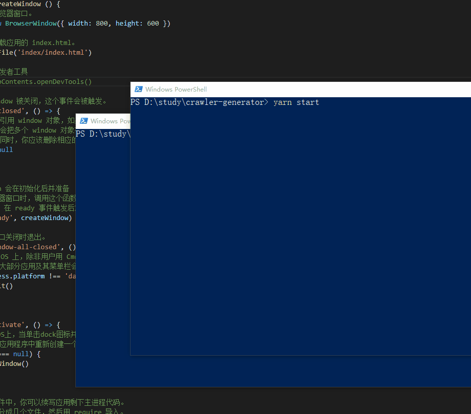

# crawler-generator | 爬虫生成器

wysiwyg crawaler generator using electron and puppeteer | 基于electron和puppeteer的所见即所得爬虫



qucik glance: https://www.youtube.com/watch?v=eAn1KRiM6vE&list=PLM1v95K5B1ntVsYvNJIxgRPppngrO_X4s

## generate code | 生成爬虫代码

```
git clone https://github.com/postor/crawler-generator.git
cd crawler-generator
npm i
npm run start
```

- fill your url and go | 输入 url 并点击 go 按钮
- click on data which you want, it's border will turn red | 在你需要的数据上单击，它的边框会变红
- click on it again to confirm and it will generate code | 再次点击，它会生成代码


## use code | 使用代码

```
mkdir myapp
cd myapp
npm i puppeteer
vi test.js # copy code into test.js | 拷贝代码到test.js
node test.js

# data will log into console | 数据会被输出到控制台 
```
